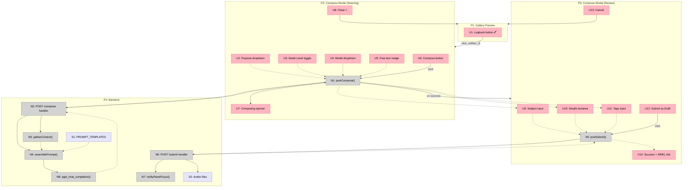

# Logbook Compose Panel — Shaping

## Source

> The idea was to have a single simple button that just prints to the logbook; however, this doesn't work because the user might have a very clear idea of what they are interested in, but our simple language model call will almost always get it wrong. Instead, I thought this button would open up the panel. The panel would not just have a submit to log button but would actually have a couple of toggle boxes and drop-down menus, and maybe even some text window where the operator can quickly steer the creation of the logbook. With the perfect user experience and a first-class design of the form that is presented, it should be very easy, very quick, and very intuitive for the operator to select the options. My idea was that, from these options, we would construct deterministically a system prompt that we then show to the model that will be tasked in drafting the logbook entry. Our job is to figure out:
> - what knobs we have
> - what kind of things we should present to the operator
> - what choices they should have to cover most or all of the cases

## Problem

The current logbook compose button fires a single LLM call with a fixed system prompt. It guesses the operator's intent from artifact metadata and the audit trail, but the operator always has specific intent the system can't infer: *why* they want to log this, *what framing* they want, and *what level of detail*. The result is a draft that needs heavy editing — defeating the purpose of automation.

## Outcome

An operator clicks "Logbook" on any artifact, sees a compact panel of well-chosen controls, makes 2-4 quick selections, and gets back an LLM-drafted entry that needs only light touch-up before submission. The controls deterministically construct the system prompt — the operator steers the LLM without writing prose.

---

## CURRENT: What Exists Today

| Part | Mechanism |
|------|-----------|
| **C1** | Pencil button injected into preview/focus action bars (`logbook.js`) |
| **C2** | Modal with spinner → form (subject, details, tags) |
| **C3** | `POST /api/logbook/compose`: gathers artifact meta + last 10 transcript events, sends to LLM with fixed system prompt |
| **C4** | Fixed `SYSTEM_PROMPT`: "Write concise, technical logbook entries... focus on what was done, what was observed, and any anomalies" |
| **C5** | `POST /api/logbook/submit`: saves draft JSON → `osprey-workspace/drafts/`, opens ARIEL |
| **C6** | ARIEL `EntryCreateRequest` fields: subject, details, author, logbook, shift, tags, attachment_ids |

**What the fixed prompt can't know:**
- Why the operator wants to log this (routine check? anomaly? investigation?)
- What narrative framing they want (observation report? action summary? investigation notes?)
- How much detail (one-liner vs. multi-paragraph)

---

## Requirements (R)

| ID | Requirement | Status |
|----|-------------|--------|
| **R0** | Operator can steer LLM output via quick selections (not prose) | Core goal |
| **R1** | Panel selections deterministically construct the system prompt | Core goal |
| **R2** | Time-to-draft under 10 seconds of operator interaction (2-4 quick picks) | Must-have |
| **R3** | Controls cover the common logbook entry types at a particle accelerator facility | Must-have |
| **R4** | Operator can optionally add free-text steering ("focus on...", "mention that...") | Must-have |
| **R5** | Draft inherits artifact context (metadata, type, session activity) automatically — no toggles needed | Must-have |
| **R6** | Operator can choose the model (cost/quality tradeoff) | Must-have |
| **R7** | Works for any artifact type (plots, tables, markdown, timeseries, dashboards, etc.) | Must-have |
| **R8** | Tone is always clean and technical — no tone selector | Must-have |

---

## Settled Controls

Four controls, decided through discussion:

### 1. Entry Purpose (dropdown — highest impact)

Determines the narrative framing of the entire draft.

| Purpose | LLM framing | Example |
|---------|-------------|---------|
| **Observation** | "I saw X, here's what it looked like" — descriptive, factual | "BL 5.0.2 beam intensity dropped 12% over 2h, plot attached" |
| **Action Taken** | "I did X because of Y, result was Z" — procedural | "Adjusted SR:C01:MG:CORR setpoint from 2.1 to 2.3 A to correct orbit drift" |
| **Anomaly / Issue** | "Something unexpected happened" — flag for follow-up | "Unexpected interlock trip on PSS, no beam loss detected, cleared manually" |
| **Investigation Notes** | "I looked into X, here's what I found" — analytical | "Traced intermittent BPM dropouts to timing board in C08, confirmed with archiver data" |
| **Routine Check** | "Everything's normal / as expected" — brief | "Hourly beam check: 498.2 mA, all IDs operational, no alarms" |
| **General** | Catch-all — relies on free-text nudge for guidance | (operator provides direction) |

### 2. Detail Level (3-way toggle)

| Level | Guidance to LLM |
|-------|----------------|
| **Brief** | 1-2 sentences. Just the facts. |
| **Standard** | 1 short paragraph. Context + observation/action + outcome. |
| **Detailed** | 2-3 paragraphs. Full narrative with supporting data references. |

### 3. Model (dropdown)

| Option | When to use |
|--------|-------------|
| **Haiku** | Fast, cheap — good for routine checks and brief entries |
| **Sonnet** | Balanced — good default for most entries |
| **Opus** | Highest quality — for detailed investigation notes or complex entries |

### 4. Free-Text Nudge (text input, optional)

Small text input: "Focus on...", "Also mention...", "Ignore the first 3 events" — appended verbatim to the system prompt. Handles the long tail of operator-specific intent that structured controls can't cover.

---

## Dropped Controls (with rationale)

| Dropped | Why |
|---------|-----|
| Tone selector | Always technical. Operators write for operators. |
| Scope toggles (artifact/session/channels/archiver) | The button is tied to a specific artifact. Context is gathered automatically — no need to toggle sources on/off. |
| Shift Handoff purpose | Dropped from purpose list — not selected |
| Configuration Change purpose | Dropped from purpose list — not selected |
| ARIEL logbook/shift fields | Left for the ARIEL form after draft submission |

---

## Shape A: Steering Panel with Deterministic Prompt Assembly

| Part | Mechanism |
|------|-----------|
| **A1** | Replace current modal with a **steering panel**: purpose dropdown, detail toggle, model dropdown, free-text input, "Compose" button |
| **A2** | **Prompt template map**: each Purpose × Detail Level combination selects a pre-written system prompt fragment. Free-text nudge appended verbatim. |
| **A3** | **Model routing**: panel sends selected model ID to backend; backend uses it for the `aget_chat_completion` call (with fallback chain if model unavailable) |
| **A4** | **Context gathering** (unchanged from CURRENT): artifact metadata + session transcript, fed as user prompt |
| **A5** | **Draft review form** (unchanged from CURRENT): subject, details, tags — editable before submission |
| **A6** | **Fallback model config**: if no `models:` section in config.yml, use hardcoded Anthropic model IDs (no 503 error) |

### Prompt Assembly (A2 detail)

```
SYSTEM_PROMPT = BASE_PREAMBLE + PURPOSE_FRAGMENT[purpose] + DETAIL_FRAGMENT[detail_level] + free_text_nudge
```

Where:
- `BASE_PREAMBLE` = "You are a logbook entry composer for a particle accelerator control room. Write clean, technical entries suitable for operator shift logs. Use clear, factual language. Avoid speculation."
- `PURPOSE_FRAGMENT` = one of 6 purpose-specific paragraphs (see Entry Purpose table)
- `DETAIL_FRAGMENT` = one of 3 length/style directives
- `free_text_nudge` = operator's optional text, appended as "Additional operator guidance: {text}"

---

## Fit Check: R × A

| Req | Requirement | Status | A |
|-----|-------------|--------|---|
| **R0** | Operator can steer LLM output via quick selections | Core goal | ✅ |
| **R1** | Selections deterministically construct the system prompt | Core goal | ✅ |
| **R2** | Time-to-draft under 10 seconds of interaction | Must-have | ✅ |
| **R3** | Controls cover common accelerator logbook entry types | Must-have | ✅ |
| **R4** | Optional free-text steering | Must-have | ✅ |
| **R5** | Draft inherits artifact context automatically | Must-have | ✅ |
| **R6** | Operator can choose the model | Must-have | ✅ |
| **R7** | Works for any artifact type | Must-have | ✅ |
| **R8** | Tone is always clean and technical | Must-have | ✅ |

All requirements pass. Shape A is straightforward — it replaces the modal internals and the prompt construction, reuses the existing context gathering and draft submission.

---

## Detail A: Breadboard

### Places

| # | Place | Description |
|---|-------|-------------|
| P1 | Gallery Preview | Existing preview/focus pane with action buttons |
| P2 | Compose Modal (Steering) | Modal phase 1: operator picks purpose, detail, model, nudge |
| P3 | Compose Modal (Review) | Modal phase 2: editable subject, details, tags before submit |
| P4 | Backend | `/api/logbook/*` routes, prompt assembly, LLM call, draft storage |

P2 and P3 are the **same DOM modal** but different Places — when the LLM returns, the steering controls disappear and the draft form appears. The operator can't interact with both at once (blocking test passes).

### UI Affordances

| # | Place | Component | Affordance | Control | Wires Out | Returns To |
|---|-------|-----------|------------|---------|-----------|------------|
| U1 | P1 | preview-actions | Logbook button (pencil icon) | click | → P2 | — |
| U2 | P2 | steering-panel | Purpose dropdown | select | — | → N1 |
| U3 | P2 | steering-panel | Detail Level toggle (Brief / Standard / Detailed) | click | — | → N1 |
| U4 | P2 | steering-panel | Model dropdown (Haiku / Sonnet / Opus) | select | — | → N1 |
| U5 | P2 | steering-panel | Free-text nudge input | type | — | → N1 |
| U6 | P2 | steering-panel | Compose button | click | → N1 | — |
| U7 | P2 | steering-panel | Composing spinner | render | — | — |
| U8 | P2 | steering-panel | Close button (×) | click | → P1 | — |
| U9 | P3 | draft-review | Subject input (pre-filled) | type | — | → N5 |
| U10 | P3 | draft-review | Details textarea (pre-filled) | type | — | → N5 |
| U11 | P3 | draft-review | Tags input (pre-filled) | type | — | → N5 |
| U12 | P3 | draft-review | Submit as Draft button | click | → N5 | — |
| U13 | P3 | draft-review | Cancel button | click | → P1 | — |
| U14 | P3 | draft-review | Success message + ARIEL link | render | — | — |

### Code Affordances

| # | Place | Component | Affordance | Control | Wires Out | Returns To |
|---|-------|-----------|------------|---------|-----------|------------|
| N1 | P2 | logbook.js | `postCompose({artifact_id, purpose, detail, model, nudge})` | call | → U7, → N2 | — |
| N2 | P4 | logbook.py | `POST /api/logbook/compose` handler | call | → N3, → N4 | → N1 |
| N3 | P4 | logbook.py | `gatherContext(artifact_id)` — reads artifact store + transcript | call | — | → N4 |
| N4 | P4 | logbook.py | `assemblePrompt(purpose, detail, nudge, ctx)` — reads S1, builds system prompt | call | → N8 | → N8 |
| N5 | P3 | logbook.js | `postSubmit({subject, details, tags, artifact_ids})` | call | → N6 | — |
| N6 | P4 | logbook.py | `POST /api/logbook/submit` handler — saves draft, returns URL | call | → S2, → N7 | → N5 |
| N7 | P4 | common.py | `notifyPanelFocus("ariel")` — tells web terminal to switch panel | call | — | — |
| N8 | P4 | logbook.py | `aget_chat_completion(prompt, model_config)` — LLM API call | call | — | → N2 |

### Data Stores

| # | Place | Store | Description |
|---|-------|-------|-------------|
| S1 | P4 | `PROMPT_TEMPLATES` | Static dict: `PURPOSE_FRAGMENTS` (6 entries) + `DETAIL_FRAGMENTS` (3 entries) + `BASE_PREAMBLE` |
| S2 | P4 | `osprey-workspace/drafts/` | Draft JSON files written on submit |

### Wiring Walkthrough

**Flow 1 — Steer & Compose (A1 + A2 + A3 + A4):**

1. **U1** (Logbook button) → opens **P2** with `artifact_id` captured from gallery state
2. Operator picks **U2** (purpose), **U3** (detail), **U4** (model), optionally types **U5** (nudge)
3. **U6** (Compose) → triggers **N1** which reads U2–U5, shows **U7** (spinner), POSTs to **N2**
4. **N2** calls **N3** (`gatherContext`) to collect artifact metadata + session transcript
5. **N2** calls **N4** (`assemblePrompt`) which reads **S1** (templates) and concatenates: `BASE_PREAMBLE + PURPOSE_FRAGMENTS[purpose] + DETAIL_FRAGMENTS[detail] + nudge`
6. **N4** passes assembled prompt to **N8** (`aget_chat_completion`) with the operator's selected model
7. **N8** returns composed JSON → **N2** parses → returns `{subject, details, tags}` to **N1**
8. **N1** hides spinner, navigates to **P3**, pre-fills **U9**, **U10**, **U11**

**Flow 2 — Review & Submit (A5):**

9. Operator edits **U9** (subject), **U10** (details), **U11** (tags) as needed
10. **U12** (Submit) → triggers **N5** which reads U9–U11, POSTs to **N6**
11. **N6** writes draft to **S2** (`drafts/`), calls **N7** (`notifyPanelFocus`)
12. **N6** returns `{draft_id, url}` to **N5** → **U14** renders success message + ARIEL link

### Mermaid Diagram


