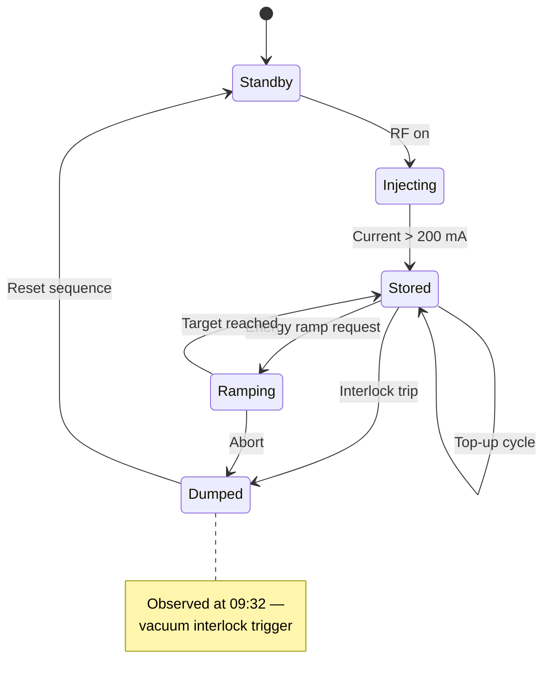

# Session Report — CSS/JS Reference Patterns

Distilled reference for generating self-contained HTML session reports. Read this file at the start of every report generation — do not rely on memory.

---

## CSS Custom Properties (OSPREY Palette)

Define both light and dark palettes. Blues/teals for data, ambers for warnings, greens for success.

```css
:root {
  --font-body: 'Outfit', system-ui, sans-serif;
  --font-mono: 'Space Mono', 'SF Mono', Consolas, monospace;

  --bg: #f8f9fa;
  --surface: #ffffff;
  --surface-elevated: #ffffff;
  --surface2: #f1f5f9;
  --border: rgba(0, 0, 0, 0.08);
  --border-bright: rgba(0, 0, 0, 0.15);
  --text: #1a1a2e;
  --text-dim: #6b7280;

  /* OSPREY accent palette */
  --accent: #0891b2;         /* teal — primary accent */
  --accent-dim: rgba(8, 145, 178, 0.1);
  --blue: #2563eb;
  --blue-dim: rgba(37, 99, 235, 0.1);
  --teal: #0d9488;
  --teal-dim: rgba(13, 148, 136, 0.1);
  --amber: #d97706;
  --amber-dim: rgba(217, 119, 6, 0.1);
  --green: #059669;
  --green-dim: rgba(5, 150, 105, 0.1);
  --red: #ef4444;
  --red-dim: rgba(239, 68, 68, 0.1);
}

@media (prefers-color-scheme: dark) {
  :root {
    --bg: #0d1117;
    --surface: #161b22;
    --surface-elevated: #1c2333;
    --surface2: #21262d;
    --border: rgba(255, 255, 255, 0.06);
    --border-bright: rgba(255, 255, 255, 0.12);
    --text: #e6edf3;
    --text-dim: #8b949e;

    --accent: #22d3ee;
    --accent-dim: rgba(34, 211, 238, 0.12);
    --blue: #60a5fa;
    --blue-dim: rgba(96, 165, 250, 0.12);
    --teal: #2dd4bf;
    --teal-dim: rgba(45, 212, 191, 0.12);
    --amber: #fbbf24;
    --amber-dim: rgba(251, 191, 36, 0.12);
    --green: #34d399;
    --green-dim: rgba(52, 211, 153, 0.12);
    --red: #f87171;
    --red-dim: rgba(248, 113, 113, 0.12);
  }
}
```

---

## Depth Tiers

Use depth to signal visual importance. Every report should use at least 3 tiers.

```css
/* Hero: executive summary, focal element — demands attention */
.node--hero {
  background: color-mix(in srgb, var(--surface) 92%, var(--accent) 8%);
  box-shadow: 0 4px 20px rgba(0, 0, 0, 0.08), 0 1px 3px rgba(0, 0, 0, 0.04);
  border-color: color-mix(in srgb, var(--border) 50%, var(--accent) 50%);
}

/* Elevated: KPIs, key findings, important cards */
.node--elevated {
  background: var(--surface-elevated);
  box-shadow: 0 2px 8px rgba(0, 0, 0, 0.08), 0 1px 2px rgba(0, 0, 0, 0.04);
}

/* Default: standard content cards */
.node {
  background: var(--surface);
  border: 1px solid var(--border);
  border-radius: 10px;
  padding: 16px 20px;
}

/* Recessed: secondary content, code blocks, detail panels */
.node--recessed {
  background: color-mix(in srgb, var(--bg) 70%, var(--surface) 30%);
  box-shadow: inset 0 1px 3px rgba(0, 0, 0, 0.06);
}
```

---

## KPI Card Pattern

Large hero number with label and optional trend. Use `fadeScale` animation.

```css
.kpi-row {
  display: grid;
  grid-template-columns: repeat(auto-fit, minmax(160px, 1fr));
  gap: 16px;
}

.kpi-card {
  background: var(--surface-elevated);
  border: 1px solid var(--border);
  border-radius: 10px;
  padding: 20px;
  box-shadow: 0 2px 8px rgba(0, 0, 0, 0.06);
  animation: fadeScale 0.35s ease-out both;
  animation-delay: calc(var(--i, 0) * 0.06s);
}

.kpi-card__value {
  font-size: 36px;
  font-weight: 700;
  letter-spacing: -1px;
  line-height: 1.1;
  font-variant-numeric: tabular-nums;
}

.kpi-card__label {
  font-family: var(--font-mono);
  font-size: 10px;
  font-weight: 600;
  text-transform: uppercase;
  letter-spacing: 1.5px;
  color: var(--text-dim);
  margin-top: 6px;
}

.kpi-card__trend {
  font-family: var(--font-mono);
  font-size: 12px;
  margin-top: 4px;
}
.kpi-card__trend--up { color: var(--green); }
.kpi-card__trend--down { color: var(--red); }
```

### CSS countUp (no JS)

```css
@property --count {
  syntax: '<integer>';
  initial-value: 0;
  inherits: false;
}

@keyframes countUp {
  to { --count: var(--target); }
}

.kpi-card__value--animated {
  --target: 247;
  counter-reset: val var(--count);
  animation: countUp 1.2s ease-out forwards;
}
.kpi-card__value--animated::after {
  content: counter(val);
}
```

Set `--target` per element in HTML: `style="--target: 42"`.

---

## Data Table Pattern

Sticky header, alternating rows, status badges, monospace numerics.

```css
.table-wrap {
  background: var(--surface);
  border: 1px solid var(--border);
  border-radius: 12px;
  overflow: hidden;
}
.table-scroll {
  overflow-x: auto;
  -webkit-overflow-scrolling: touch;
}
.data-table {
  width: 100%;
  border-collapse: collapse;
  font-size: 13px;
  line-height: 1.5;
}
.data-table thead {
  position: sticky;
  top: 0;
  z-index: 2;
}
.data-table th {
  background: var(--surface-elevated);
  font-family: var(--font-mono);
  font-size: 11px;
  font-weight: 600;
  text-transform: uppercase;
  letter-spacing: 1px;
  color: var(--text-dim);
  text-align: left;
  padding: 12px 16px;
  border-bottom: 2px solid var(--border-bright);
  white-space: nowrap;
}
.data-table td {
  padding: 12px 16px;
  border-bottom: 1px solid var(--border);
  vertical-align: top;
}
.data-table td.num, .data-table th.num {
  text-align: right;
  font-variant-numeric: tabular-nums;
  font-family: var(--font-mono);
}
.data-table tbody tr:nth-child(even) {
  background: var(--accent-dim);
}
.data-table tbody tr:hover {
  background: var(--border);
}
.data-table tbody tr:last-child td {
  border-bottom: none;
}
.data-table code {
  font-family: var(--font-mono);
  font-size: 11px;
  background: var(--accent-dim);
  color: var(--accent);
  padding: 1px 5px;
  border-radius: 3px;
}
```

### Status Badges

```css
.status {
  display: inline-flex;
  align-items: center;
  gap: 6px;
  font-family: var(--font-mono);
  font-size: 11px;
  font-weight: 500;
  padding: 3px 10px;
  border-radius: 6px;
  white-space: nowrap;
}
.status--ok { background: var(--green-dim); color: var(--green); }
.status--warn { background: var(--amber-dim); color: var(--amber); }
.status--error { background: var(--red-dim); color: var(--red); }
.status--info { background: var(--accent-dim); color: var(--accent); }
```

---

## Mermaid Diagrams

### Theming

Always use `theme: 'base'` — it's the only theme where all `themeVariables` are fully customizable.

```javascript
const isDark = window.matchMedia('(prefers-color-scheme: dark)').matches;
mermaid.initialize({
  startOnLoad: true,
  theme: 'base',
  look: 'classic',
  themeVariables: {
    primaryColor: isDark ? '#1e3a5f' : '#dbeafe',
    primaryBorderColor: isDark ? '#60a5fa' : '#2563eb',
    primaryTextColor: isDark ? '#e6edf3' : '#1a1a2e',
    secondaryColor: isDark ? '#1c2333' : '#f0fdf4',
    secondaryBorderColor: isDark ? '#34d399' : '#059669',
    secondaryTextColor: isDark ? '#e6edf3' : '#1a1a2e',
    tertiaryColor: isDark ? '#27201a' : '#fef3c7',
    tertiaryBorderColor: isDark ? '#fbbf24' : '#d97706',
    tertiaryTextColor: isDark ? '#e6edf3' : '#1a1a2e',
    lineColor: isDark ? '#6b7280' : '#9ca3af',
    fontSize: '14px',
    fontFamily: 'var(--font-body)',
    noteBkgColor: isDark ? '#1c2333' : '#fefce8',
    noteTextColor: isDark ? '#e6edf3' : '#1a1a2e',
    noteBorderColor: isDark ? '#fbbf24' : '#d97706',
  }
});
```

### CSS Overrides (always include)

```css
.mermaid .nodeLabel { color: var(--text) !important; }
.mermaid .edgeLabel { color: var(--text-dim) !important; background-color: var(--bg) !important; }
.mermaid .edgeLabel rect { fill: var(--bg) !important; }
```

### Zoom Controls

```css
.mermaid-wrap {
  position: relative;
  background: var(--surface);
  border: 1px solid var(--border);
  border-radius: 12px;
  padding: 32px 24px;
  overflow: auto;
  scrollbar-width: thin;
  scrollbar-color: var(--border) transparent;
}
.mermaid-wrap .mermaid {
  transition: transform 0.2s ease;
  transform-origin: top center;
}
.zoom-controls {
  position: absolute;
  top: 8px;
  right: 8px;
  display: flex;
  gap: 2px;
  z-index: 10;
  background: var(--surface);
  border: 1px solid var(--border);
  border-radius: 6px;
  padding: 2px;
}
.zoom-controls button {
  width: 28px;
  height: 28px;
  border: none;
  background: transparent;
  color: var(--text-dim);
  font-family: var(--font-mono);
  font-size: 14px;
  cursor: pointer;
  border-radius: 4px;
  display: flex;
  align-items: center;
  justify-content: center;
}
.zoom-controls button:hover {
  background: var(--border);
  color: var(--text);
}
.mermaid-wrap.is-zoomed { cursor: grab; }
.mermaid-wrap.is-panning { cursor: grabbing; user-select: none; }
```

```html
<div class="mermaid-wrap">
  <div class="zoom-controls">
    <button onclick="zoomDiagram(this, 1.2)" title="Zoom in">+</button>
    <button onclick="zoomDiagram(this, 0.8)" title="Zoom out">&minus;</button>
    <button onclick="resetZoom(this)" title="Reset">&#8634;</button>
  </div>
  <pre class="mermaid">graph TD ...</pre>
</div>
```

```javascript
function zoomDiagram(btn, factor) {
  var wrap = btn.closest('.mermaid-wrap');
  var target = wrap.querySelector('.mermaid');
  var current = parseFloat(target.dataset.zoom || '1');
  var next = Math.min(Math.max(current * factor, 0.3), 5);
  target.dataset.zoom = next;
  target.style.transform = 'scale(' + next + ')';
  wrap.classList.toggle('is-zoomed', next > 1);
}
function resetZoom(btn) {
  var wrap = btn.closest('.mermaid-wrap');
  var target = wrap.querySelector('.mermaid');
  target.dataset.zoom = '1';
  target.style.transform = 'scale(1)';
  wrap.classList.remove('is-zoomed');
}
// Ctrl/Cmd + scroll to zoom on all .mermaid-wrap containers
document.querySelectorAll('.mermaid-wrap').forEach(function(wrap) {
  wrap.addEventListener('wheel', function(e) {
    if (!e.ctrlKey && !e.metaKey) return;
    e.preventDefault();
    var target = wrap.querySelector('.mermaid');
    var current = parseFloat(target.dataset.zoom || '1');
    var factor = e.deltaY < 0 ? 1.1 : 0.9;
    var next = Math.min(Math.max(current * factor, 0.3), 5);
    target.dataset.zoom = next;
    target.style.transform = 'scale(' + next + ')';
    wrap.classList.toggle('is-zoomed', next > 1);
  }, { passive: false });
  // Drag-to-pan when zoomed
  var startX, startY, scrollL, scrollT;
  wrap.addEventListener('mousedown', function(e) {
    if (e.target.closest('.zoom-controls')) return;
    var target = wrap.querySelector('.mermaid');
    if (parseFloat(target.dataset.zoom || '1') <= 1) return;
    wrap.classList.add('is-panning');
    startX = e.clientX; startY = e.clientY;
    scrollL = wrap.scrollLeft; scrollT = wrap.scrollTop;
  });
  window.addEventListener('mousemove', function(e) {
    if (!wrap.classList.contains('is-panning')) return;
    wrap.scrollLeft = scrollL - (e.clientX - startX);
    wrap.scrollTop = scrollT - (e.clientY - startY);
  });
  window.addEventListener('mouseup', function() { wrap.classList.remove('is-panning'); });
});
```

### Mermaid Event Timeline

Use the `timeline` diagram type when the session involved a sequence of events that benefit from grouping by time period or phase. This is more expressive than the CSS timeline — it shows structure and grouping, not just a flat list.

```mermaid
timeline
    title Session Event Timeline
    section Morning Checks
      08:30 : Beam current check
            : 302.1 mA observed
      08:45 : Vacuum interlock verified
    section Investigation
      09:15 : Anomaly noted in SR:C03-MG:PS
      09:30 : Archiver query 2h window
            : Downward drift confirmed
    section Resolution
      10:00 : Operator notified shift lead
      10:15 : Channel added to watch list
```

**When to use**: 5+ events, natural phase groupings, or when chronological structure matters more than a simple list. Falls back to CSS timeline for short linear sequences (3-4 items).

### Mermaid State Diagram

Use `stateDiagram-v2` when the session revealed state transitions in a control system — beam states, interlock chains, operational mode changes, or any finite-state-machine behavior observed during the session.



**When to use**: Only when actual state changes were observed during the session. Never fabricate a state model — derive it from what was seen. Good for Analysis Reports documenting interlock sequences, mode transitions, or multi-step operational procedures.

**Selecting between timeline and state diagram**: Timelines answer "what happened when?" — state diagrams answer "what transitions occurred and why?" If both questions are relevant, include both.

---

## Chart.js Setup

```html
<script src="https://cdn.jsdelivr.net/npm/chart.js@4/dist/chart.umd.min.js"></script>
```

```javascript
const isDark = window.matchMedia('(prefers-color-scheme: dark)').matches;
const textColor = isDark ? '#8b949e' : '#6b7280';
const gridColor = isDark ? 'rgba(255,255,255,0.06)' : 'rgba(0,0,0,0.06)';
const fontFamily = getComputedStyle(document.documentElement)
  .getPropertyValue('--font-body').trim() || 'system-ui, sans-serif';

// Apply to every chart:
// options.plugins.legend.labels: { color: textColor, font: { family: fontFamily } }
// options.scales.x/y: { ticks: { color: textColor, font: { family: fontFamily } }, grid: { color: gridColor } }
```

### Line Chart (Trend Analysis)

```javascript
new Chart(canvas, {
  type: 'line',
  data: {
    labels: timestamps,
    datasets: [{
      label: 'Channel Value',
      data: values,
      borderColor: isDark ? '#22d3ee' : '#0891b2',
      backgroundColor: isDark ? 'rgba(34, 211, 238, 0.1)' : 'rgba(8, 145, 178, 0.1)',
      fill: true,
      tension: 0.3,
      pointRadius: 2,
    }]
  },
  options: {
    responsive: true,
    plugins: {
      legend: { labels: { color: textColor, font: { family: fontFamily } } },
    },
    scales: {
      x: { ticks: { color: textColor, font: { family: fontFamily } }, grid: { color: gridColor } },
      y: { ticks: { color: textColor, font: { family: fontFamily } }, grid: { color: gridColor } },
    }
  }
});
```

### Chart Container

```css
.chart-container {
  background: var(--surface);
  border: 1px solid var(--border);
  border-radius: 10px;
  padding: 20px;
}
.chart-container canvas { max-height: 300px; }
```

---

## Responsive Section Navigation (Sidebar TOC)

Desktop: sticky sidebar. Mobile: sticky horizontal bar.

### HTML Structure

```html
<div class="wrap">
  <nav class="toc" id="toc">
    <div class="toc-title">Contents</div>
    <a href="#s1">1. Executive Summary</a>
    <a href="#s2">2. Data Investigation</a>
    <!-- one link per section -->
  </nav>
  <div class="main">
    <!-- page content with id="s1", id="s2" on section headings -->
  </div>
</div>
```

### CSS

```css
.wrap {
  max-width: 1400px;
  margin: 0 auto;
  display: grid;
  grid-template-columns: 170px 1fr;
  gap: 0 40px;
}
.main { min-width: 0; }

/* Sidebar TOC */
.toc {
  position: sticky;
  top: 24px;
  align-self: start;
  padding: 14px 0;
  grid-row: 1 / -1;
  max-height: calc(100dvh - 48px);
  overflow-y: auto;
}
.toc-title {
  font-family: var(--font-mono);
  font-size: 9px;
  font-weight: 700;
  text-transform: uppercase;
  letter-spacing: 2px;
  color: var(--text-dim);
  padding: 0 0 10px;
  margin-bottom: 8px;
  border-bottom: 1px solid var(--border);
}
.toc a {
  display: block;
  font-size: 11px;
  color: var(--text-dim);
  text-decoration: none;
  padding: 4px 8px;
  border-radius: 5px;
  border-left: 2px solid transparent;
  transition: all 0.15s;
  line-height: 1.4;
  margin-bottom: 1px;
}
.toc a:hover { color: var(--text); background: var(--surface2); }
.toc a.active { color: var(--text); border-left-color: var(--accent); }

/* Mobile: horizontal bar */
@media (max-width: 1000px) {
  .wrap { grid-template-columns: 1fr; padding-top: 0; }
  .toc {
    position: sticky; top: 0; z-index: 200;
    max-height: none; display: flex; gap: 4px;
    overflow-x: auto; -webkit-overflow-scrolling: touch;
    background: var(--bg);
    border-bottom: 1px solid var(--border);
    padding: 10px 16px; grid-row: auto;
  }
  .toc::-webkit-scrollbar { display: none; }
  .toc-title { display: none; }
  .toc a {
    white-space: nowrap; flex-shrink: 0;
    border-left: none; border-bottom: 2px solid transparent;
    border-radius: 4px 4px 0 0; padding: 6px 10px; font-size: 10px;
  }
  .toc a.active { border-left: none; border-bottom-color: var(--accent); background: var(--surface); }
  .sec-head { scroll-margin-top: 52px; }
}
```

### Scroll-Spy JavaScript

```javascript
(function() {
  const toc = document.getElementById('toc');
  const links = toc.querySelectorAll('a');
  const sections = [];
  links.forEach(link => {
    const id = link.getAttribute('href').slice(1);
    const el = document.getElementById(id);
    if (el) sections.push({ id, el, link });
  });
  const observer = new IntersectionObserver(entries => {
    entries.forEach(entry => {
      if (entry.isIntersecting) {
        links.forEach(l => l.classList.remove('active'));
        const match = sections.find(s => s.el === entry.target);
        if (match) {
          match.link.classList.add('active');
          if (window.innerWidth <= 1000) {
            match.link.scrollIntoView({ behavior: 'smooth', block: 'nearest', inline: 'center' });
          }
        }
      }
    });
  }, { rootMargin: '-10% 0px -80% 0px' });
  sections.forEach(s => observer.observe(s.el));
  links.forEach(link => {
    link.addEventListener('click', e => {
      e.preventDefault();
      const id = link.getAttribute('href').slice(1);
      const el = document.getElementById(id);
      if (el) {
        el.scrollIntoView({ behavior: 'smooth', block: 'start' });
        history.replaceState(null, '', '#' + id);
      }
    });
  });
})();
```

---

## Animations

### Core Keyframes

```css
@keyframes fadeUp {
  from { opacity: 0; transform: translateY(12px); }
  to { opacity: 1; transform: translateY(0); }
}

@keyframes fadeScale {
  from { opacity: 0; transform: scale(0.92); }
  to { opacity: 1; transform: scale(1); }
}
```

### Usage by Element Role

| Element | Animation | Delay pattern |
|---------|-----------|--------------|
| Content cards | `fadeUp 0.4s ease-out both` | `calc(var(--i, 0) * 0.05s)` |
| KPI cards | `fadeScale 0.35s ease-out both` | `calc(var(--i, 0) * 0.06s)` |
| Section headings | `fadeUp 0.4s ease-out both` | `calc(var(--i, 0) * 0.05s)` |

Set `--i` per element: `style="--i: 0"`, `style="--i: 1"`, etc.

### Reduced Motion

```css
@media (prefers-reduced-motion: reduce) {
  *, *::before, *::after {
    animation-duration: 0.01ms !important;
    animation-iteration-count: 1 !important;
    transition-duration: 0.01ms !important;
  }
}
```

---

## Overflow Protection

Always include these globals to prevent content blowout:

```css
.grid > *, .flex > *,
[style*="display: grid"] > *,
[style*="display: flex"] > * {
  min-width: 0;
}
body { overflow-wrap: break-word; }
```

Never use `display: flex` on `<li>` for marker characters — use absolute positioning instead:

```css
li { padding-left: 14px; position: relative; }
li::before { content: '\203A'; position: absolute; left: 0; color: var(--text-dim); }
```

---

## Collapsible Sections

```css
details.collapsible {
  border: 1px solid var(--border);
  border-radius: 10px;
  overflow: hidden;
}
details.collapsible summary {
  padding: 14px 20px;
  background: var(--surface);
  font-family: var(--font-mono);
  font-size: 12px;
  font-weight: 600;
  cursor: pointer;
  list-style: none;
  display: flex;
  align-items: center;
  gap: 8px;
}
details.collapsible summary::-webkit-details-marker { display: none; }
details.collapsible summary::before {
  content: '\25B8';
  font-size: 11px;
  color: var(--text-dim);
  transition: transform 0.15s ease;
}
details.collapsible[open] summary::before {
  transform: rotate(90deg);
}
details.collapsible .collapsible__body {
  padding: 16px 20px;
  border-top: 1px solid var(--border);
  font-size: 13px;
  line-height: 1.6;
}
```

---

## Diff / Comparison Panels

```css
.diff-panels {
  display: grid;
  grid-template-columns: 1fr 1fr;
  gap: 0;
  border: 1px solid var(--border);
  border-radius: 10px;
  overflow: hidden;
}
.diff-panels > * { min-width: 0; overflow-wrap: break-word; }
.diff-panel__header {
  font-family: var(--font-mono);
  font-size: 11px;
  font-weight: 600;
  text-transform: uppercase;
  letter-spacing: 1px;
  padding: 10px 16px;
}
.diff-panel__header--before {
  background: var(--red-dim);
  color: var(--red);
  border-bottom: 2px solid var(--red);
}
.diff-panel__header--after {
  background: var(--green-dim);
  color: var(--green);
  border-bottom: 2px solid var(--green);
}
.diff-panel__body {
  padding: 16px;
  background: var(--surface);
  font-size: 13px;
  line-height: 1.6;
}
@media (max-width: 768px) {
  .diff-panels { grid-template-columns: 1fr; }
}
```

---

## Google Fonts

Load with `display=swap`. Rotate pairings — never use Inter, Roboto, Arial as primary.

```html
<link rel="preconnect" href="https://fonts.googleapis.com">
<link rel="preconnect" href="https://fonts.gstatic.com" crossorigin>
<link href="https://fonts.googleapis.com/css2?family=BODY_FONT:wght@400;500;600;700&family=MONO_FONT:wght@400;700&display=swap" rel="stylesheet">
```

### Font Pairing Rotation

| Body / Headings | Mono / Labels | Feel |
|---|---|---|
| Outfit | Space Mono | Clean geometric |
| Instrument Serif | JetBrains Mono | Editorial, refined |
| Sora | IBM Plex Mono | Technical, precise |
| DM Sans | Fira Code | Friendly, developer |
| Fraunces | Source Code Pro | Warm, distinctive |
| Manrope | Martian Mono | Soft, contemporary |
| Bricolage Grotesque | Fragment Mono | Bold, characterful |
| Crimson Pro | Noto Sans Mono | Scholarly, serious |
| Plus Jakarta Sans | Azeret Mono | Rounded, approachable |

Pick a different pairing each time. Update `--font-body` and `--font-mono` to match.

---

## Section Heading Pattern

Monospace label with colored dot indicator:

```css
.sec-head {
  font-family: var(--font-mono);
  font-size: 11px;
  font-weight: 600;
  text-transform: uppercase;
  letter-spacing: 1.5px;
  color: var(--accent);
  display: flex;
  align-items: center;
  gap: 8px;
  margin: 40px 0 16px;
  padding-bottom: 8px;
  border-bottom: 1px solid var(--border);
}
.sec-head::before {
  content: '';
  width: 8px;
  height: 8px;
  border-radius: 50%;
  background: currentColor;
}
```

---

## Card Grid (Artifacts Gallery / Recommendations)

```css
.card-grid {
  display: grid;
  grid-template-columns: repeat(auto-fit, minmax(240px, 1fr));
  gap: 16px;
}
```

For recommendation cards with colored left border:

```css
.rec-card {
  background: var(--surface);
  border: 1px solid var(--border);
  border-left: 3px solid var(--accent);
  border-radius: 10px;
  padding: 16px 20px;
}
.rec-card--high { border-left-color: var(--red); }
.rec-card--medium { border-left-color: var(--amber); }
.rec-card--low { border-left-color: var(--green); }
```

---

## Severity Cards (Operational Findings)

```css
.severity-card {
  border-radius: 10px;
  padding: 16px 20px;
  border: 1px solid var(--border);
}
.severity-card--critical {
  background: var(--red-dim);
  border-color: var(--red);
}
.severity-card--warning {
  background: var(--amber-dim);
  border-color: var(--amber);
}
.severity-card--info {
  background: var(--blue-dim);
  border-color: var(--blue);
}
```

---

## CSS Timeline

```css
.timeline {
  position: relative;
  padding-left: 24px;
}
.timeline::before {
  content: '';
  position: absolute;
  left: 7px;
  top: 0;
  bottom: 0;
  width: 2px;
  background: var(--border-bright);
}
.timeline-item {
  position: relative;
  margin-bottom: 24px;
  padding-left: 20px;
}
.timeline-item::before {
  content: '';
  position: absolute;
  left: -20px;
  top: 6px;
  width: 10px;
  height: 10px;
  border-radius: 50%;
  background: var(--accent);
  border: 2px solid var(--bg);
}
.timeline-item__time {
  font-family: var(--font-mono);
  font-size: 11px;
  color: var(--text-dim);
}
.timeline-item__content {
  margin-top: 4px;
  font-size: 13px;
  line-height: 1.5;
}
```
